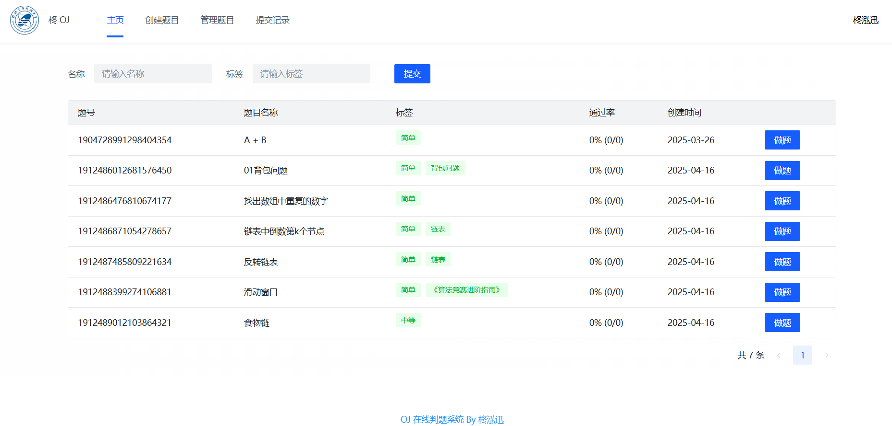
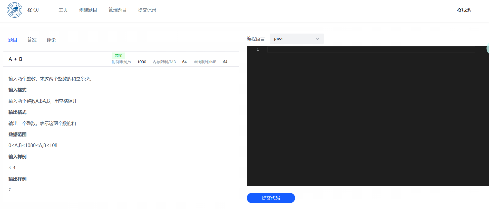
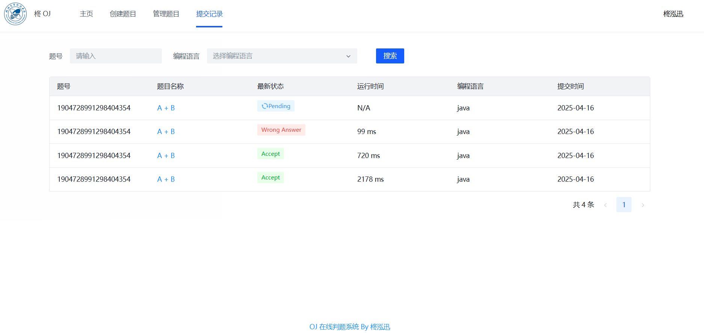
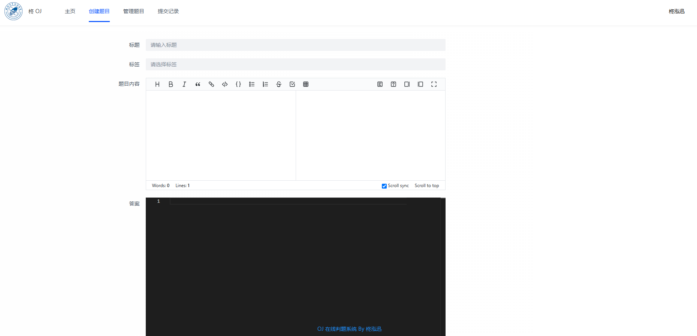
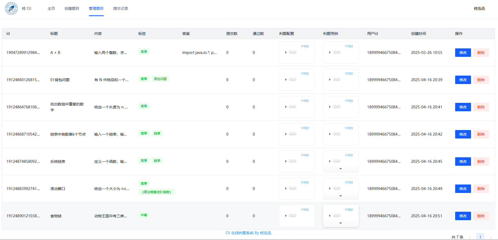

# ZhongOJ 在线评测系统

## 项目简介
ZhongOJ 是一个功能完整的在线编程评测系统，支持用户在线编程、提交代码、查看评测结果等功能。系统采用前后端分离架构，支持单体部署和微服务部署两种模式。

## 系统架构
系统由以下几个主要部分组成：

1. **前端项目 (zhongoj-frontend)**
   - 基于 Vue 3 + TypeScript 开发
   - 使用 Arco Design 组件库
   - 集成 Monaco Editor 代码编辑器
   - 支持 Markdown 渲染

2. **后端单体服务 (zhongoj-backend)**
   - 基于 Spring Boot 2.7.2 开发
   - 使用 MyBatis-Plus 作为 ORM 框架
   - 集成 Redis 用于缓存和会话管理
   - 集成腾讯云 COS 用于文件存储

3. **微服务版本 (zhongoj-backend-microserver)**
   - 将单体服务拆分为多个微服务
   - 支持服务注册与发现
   - 实现服务间通信
   - 提供更好的可扩展性

4. **代码沙箱服务 (zhong-code-sandbox)**
   - 独立的代码执行环境
   - 基于 Docker 实现代码隔离
   - 支持多种编程语言
   - 提供安全的代码执行环境

## 技术栈

### 前端技术栈
- Vue 3
- TypeScript
- Vuex
- Vue Router
- Arco Design
- Monaco Editor
- Axios
- Moment.js

### 后端技术栈
- Spring Boot 2.7.2
- MyBatis-Plus
- Redis
- Docker
- Maven
- Knife4j (API 文档)
- Hutool (工具库)

## 功能特性
- 用户注册与登录
- 题目管理
- 代码提交与评测
- 题目搜索
- 排行榜

## 部署说明

### 环境要求
- JDK 1.8+
- Maven 3.6+
- Node.js 14+
- Docker
- Redis

### 部署步骤
1. 克隆项目
```bash
git clone [项目地址]
```

2. 部署代码沙箱服务
```bash
cd zhong-code-sandbox
mvn clean package
docker build -t code-sandbox .
docker run -d -p 8090:8090 code-sandbox
```

3. 部署后端服务
```bash
# 单体部署
cd zhongoj-backend
mvn clean package
java -jar target/zhongoj-backend-0.0.1-SNAPSHOT.jar

# 或微服务部署
cd zhongoj-backend-microserver
# 按需启动各个微服务
```

4. 部署前端项目
```bash
cd zhongoj-frontend
npm install
npm run build
# 将构建后的文件部署到 Nginx 或其他 Web 服务器
```

## 项目截图
1. 首页界面

3. 答题页面

4. 评测结果页面

5. 管理员创建题目页面

6. 管理员管理题目页面
